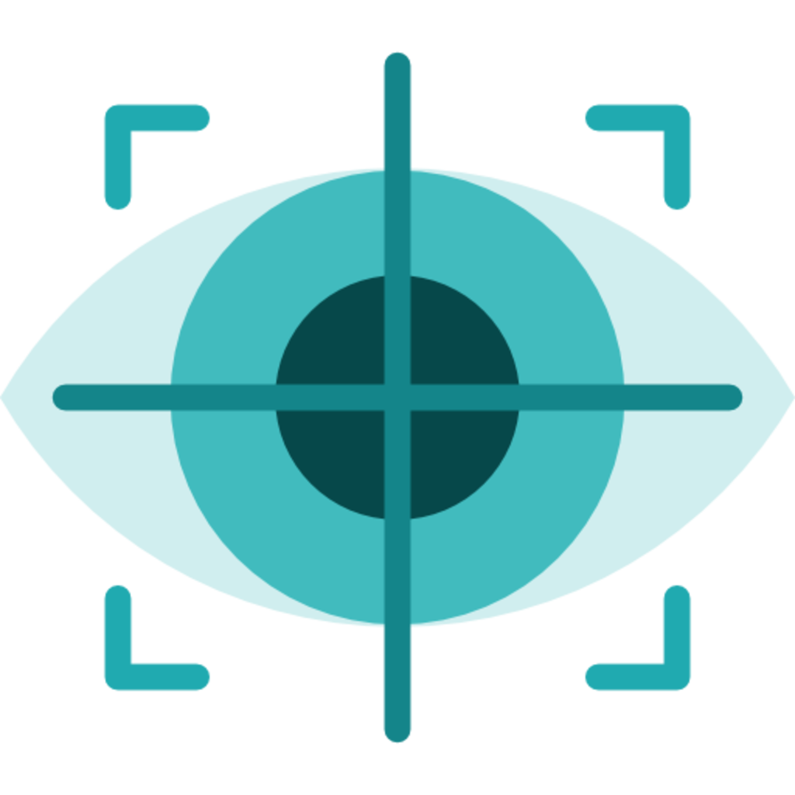

# Eye Gaze Tracking with ARKit and ARFaceAnchor

This project demonstrates eye gaze tracking on a mobile screen using the front camera and ARKit's ARFaceAnchor feature. By utilizing ARFaceAnchor and the lookAtPoint property, we can accurately determine the user's eye gaze direction on their device's screen.

## Prerequisites

* Xcode 12 or later
* iOS device with TrueDepth camera support (iPhone X or newer)

## Logic Explanation

Code utilizes the face anchor and camera transformations to convert the user's gaze direction from the local coordinate space to the world coordinate system. Then, by applying the inverse of the camera transformation, the gaze direction is mapped onto the screen plane. The resulting coordinates are scaled and clamped to obtain the focus point, indicating where the user is looking on their mobile screen.

## limitations of eye tracking with ARKit

* <B>Head movement</B>: Head movement can affect the accuracy of eye tracking, especially if the user is moving their head quickly.
* <B>Blinking</B>: Blinking can also affect the accuracy of eye tracking, as the camera may not be able to track the user's eyes during a blink.
* <B>Ambient lighting</B>: Ambient lighting can also affect the accuracy of eye tracking, as the camera may not be able to see the user's eyes properly if the lighting is too bright or too dark.
* <B>Other Factors</B>: Glasses and accessories, Eyelid occlusion, Eye conditions, Distance and angle, Limited field of view:, Environmental factors, Hardware limitations

## Acknowledgements

* [eye-tracking-ios-prototype](https://github.com/virakri/eye-tracking-ios-prototype) by [virakri](https://github.com/virakri) for the calculation of screenX and screenY.

## Contact

For any inquiries or suggestions, please feel free to reach out to [Shiru99](https://www.linkedin.com/in/shriram-ghadge)

---

## YT Demo

